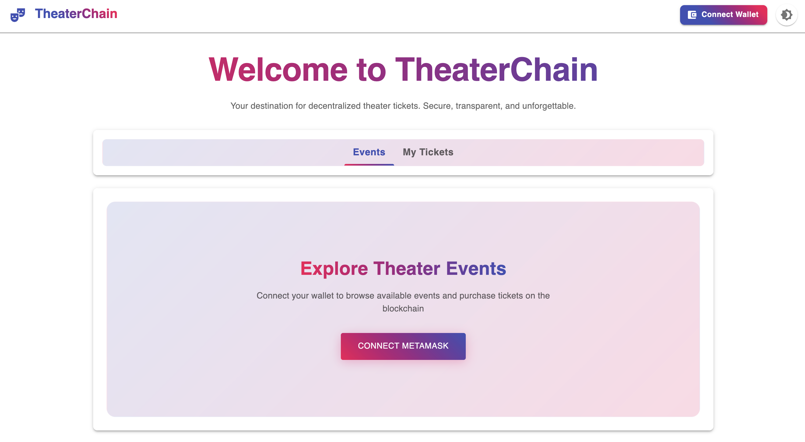
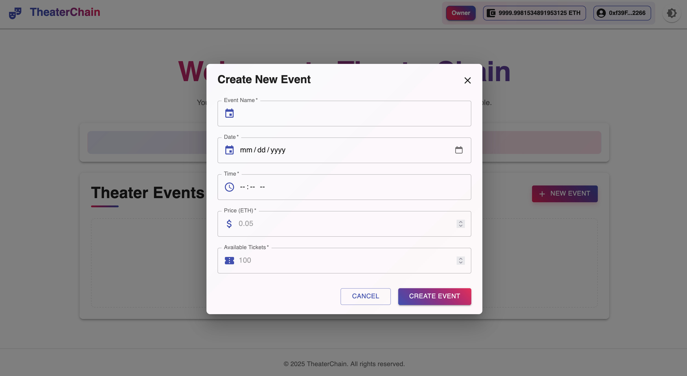
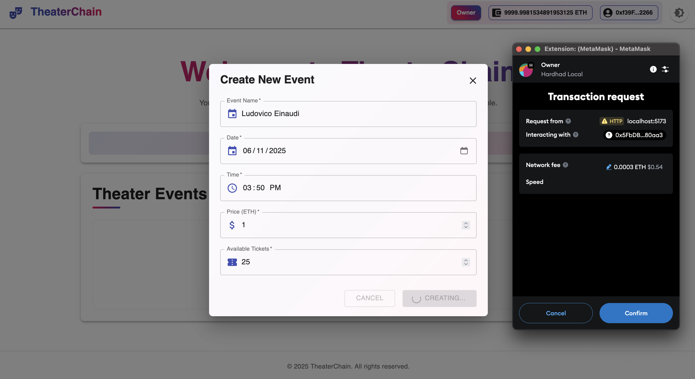
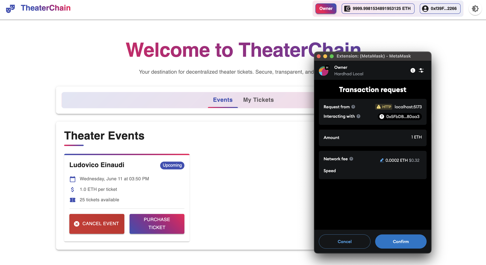
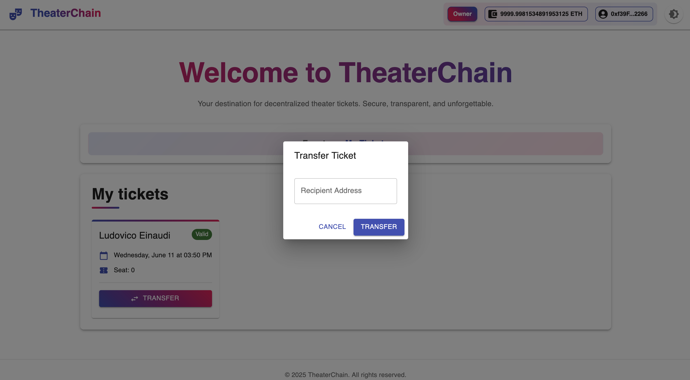

## 🎯 Project Overview

This decentralized application (dApp) is a blockchain-based ticketing system developed as part of the _Bachelor in Computer Science – Blockchain Engineering: Foundations and Applications_ course.

The application aims to:

- Develop technical skills in smart contract development and dApp architecture.
- Explore and critically analyze the benefits and challenges of decentralization.

### ✨ Core Features

- Creation of events with ticket issuance
- Ticket purchasing with blockchain payment
- Ticket validation mechanism
- Secure ticket transfer between users
- Automatic refunds in case of event cancellation

---

## ⚙️ Setup Instructions

> Follow these steps to prepare your development environment:

1. **Clone the repository**:

   ```bash
   git clone g[it@gitlab-edu.supsi.ch:dti-isin/giuliano.gremlich/opzione-blockchain-engineering/24-25/progetti-studenti/celli-eltaher.git](https://github.com/adelitoo/Blockchain-ticketing-system.git)
   cd Blockchain-ticketing-system
   ```

2. **Install dependencies**:
   - For the backend (Hardhat and smart contracts):
     ```bash
     cd backend
     npm install
     ```
   - For the frontend (web app):
     ```bash
     cd ../frontend
     npm install
     ```

---

## 🚀 Deployment Guide

> How to deploy the smart contracts to a local blockchain:

1. **Start the local Hardhat node**:

   ```bash
   cd backend
   npx hardhat node
   ```

2. **In a separate terminal, deploy the contracts**:
   ```bash
   cd backend
   npx hardhat run scripts/deploy.ts --network localhost
   ```

---

## 🖥️ Running the Application Locally

> To start the frontend web application:

1. Navigate to the frontend directory:

   ```bash
   cd ../frontend
   ```

2. Run the development server:
   ```bash
   npm run dev
   ```

The app should now be running at [http://localhost:3000](http://localhost:3000).

---

## 🧪 Testing Instructions

> To run all tests:

1. Make sure the local blockchain is running:

   ```bash
   cd backend
   npx hardhat node
   ```

2. Run the tests in a separate terminal:

   ```bash
   cd backend
   npx hardhat test
   ```

3. You can also test the frontend:
   ```bash
   cd ../frontend
   npm test
   ```

---

## 🖼️ Screenshots

### 🏠 Home Page



### 🎟️ Create Event Page




### 💳 Ticket Purchase



### 💳 Ticket Transfer


